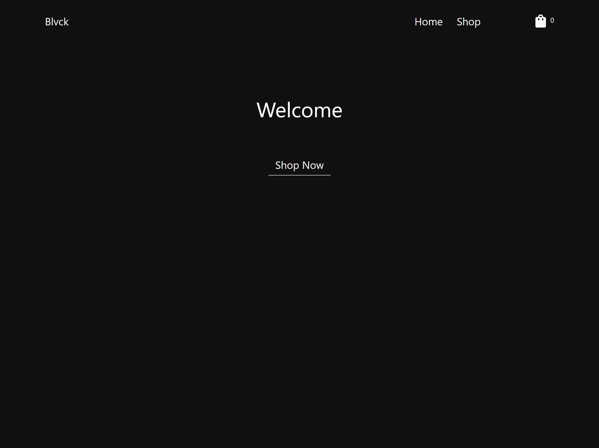
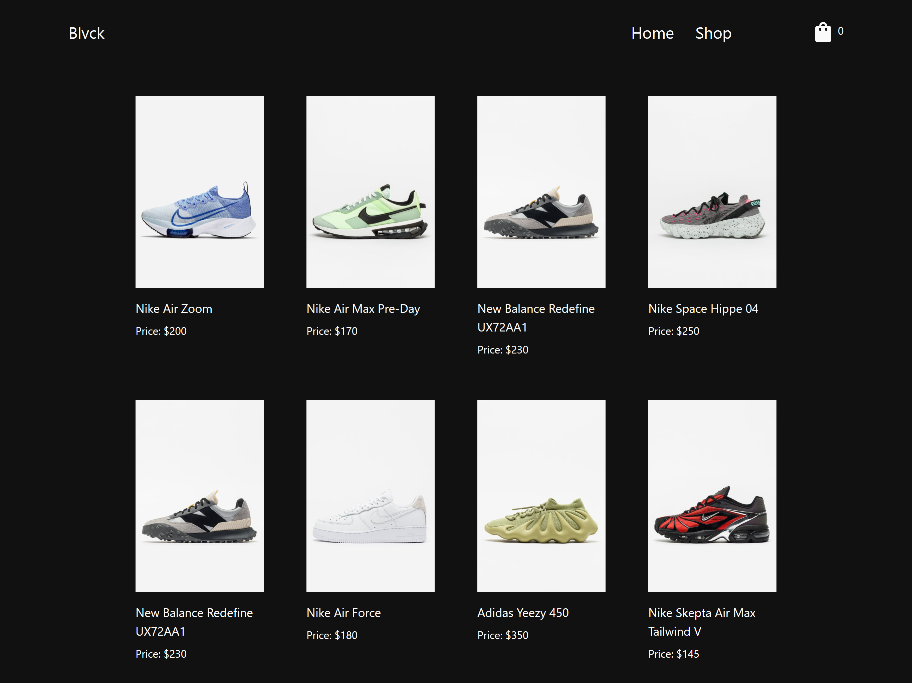
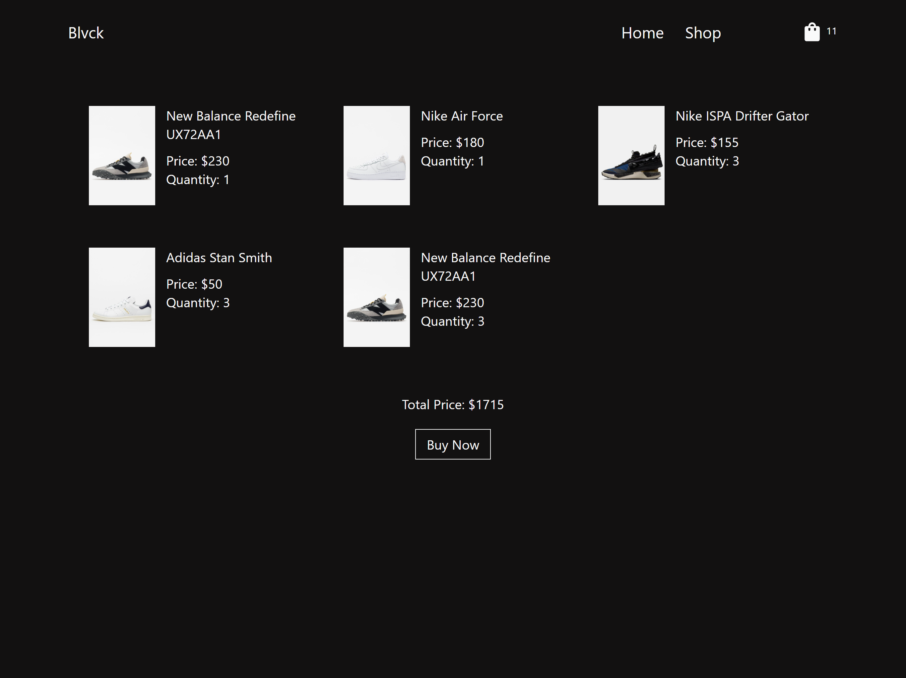

# Blvck store

This is a simple online store made with react and react-router-dom to practice routing.
Made as part as [The Odin's Project Curriculum](https://www.theodinproject.com/paths/full-stack-ruby-on-rails/courses/javascript/lessons/shopping-cart)

[Live Demo](https://peter-abah.github.io/shopping-site)

## Built with
- React
- react-router-dom

## Screenshots

### Home Page

### Shop Page

### Home Page
